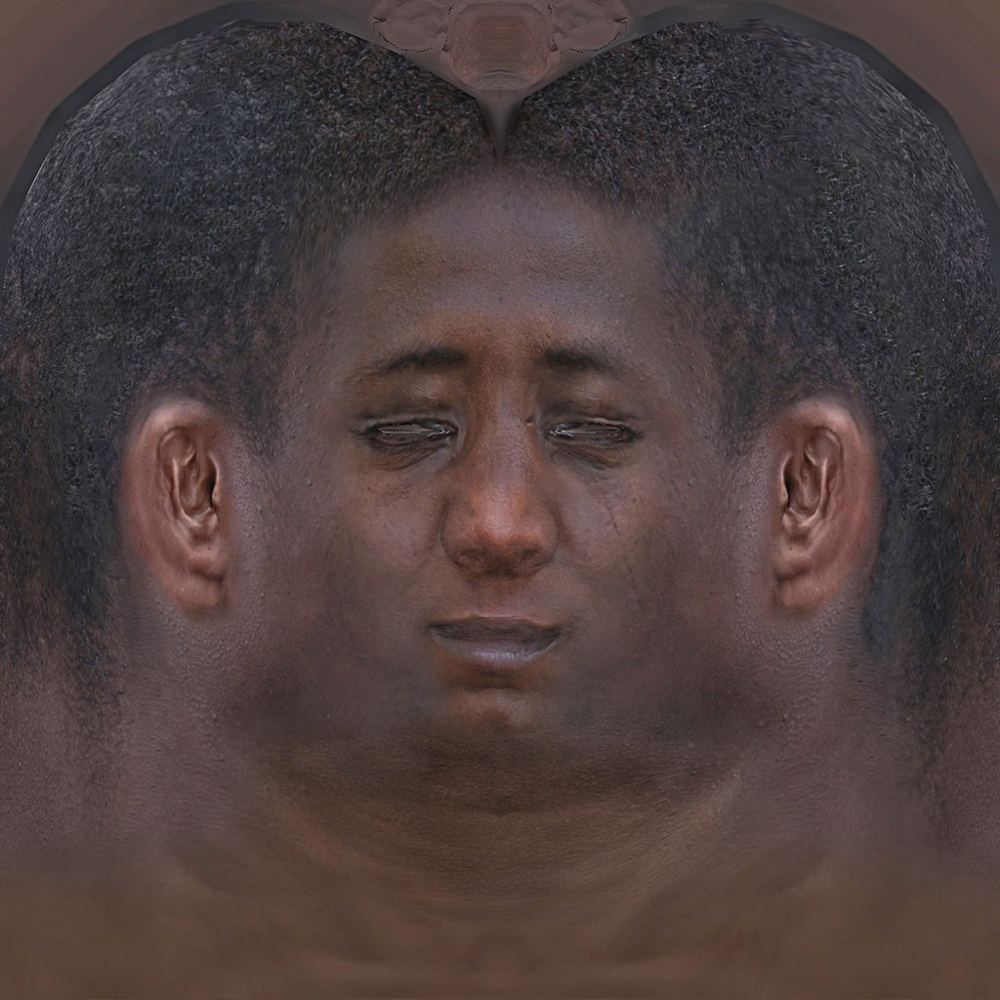
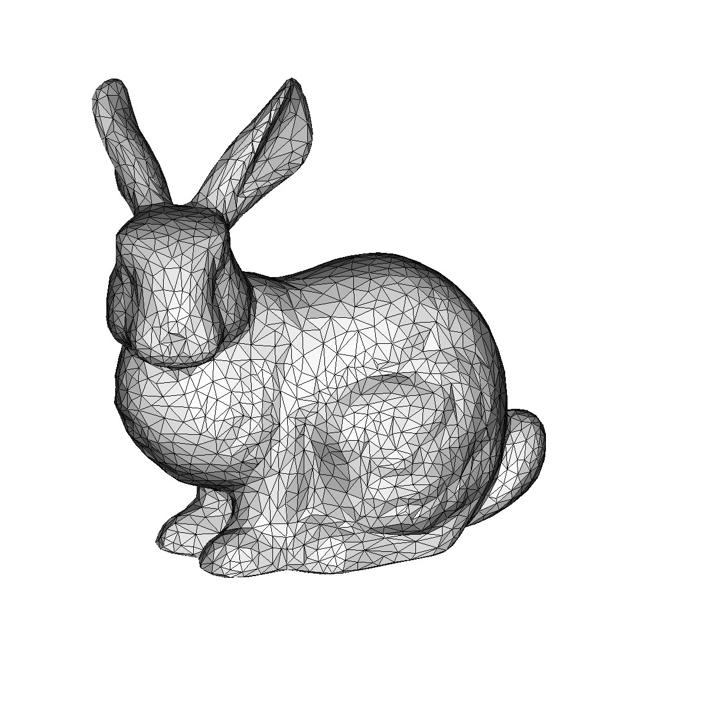

### A tiny software 3D renderer in 100 lines of Python

Translated from https://github.com/ssloy/tinyrenderer/wiki - Model by [Vidar Rapp](https://se.linkedin.com/in/vidarrapp)  
2492 z-tested, textured & lighted triangles rendered in 0.35 second (~3 FPS) on a Macbook Pro  

